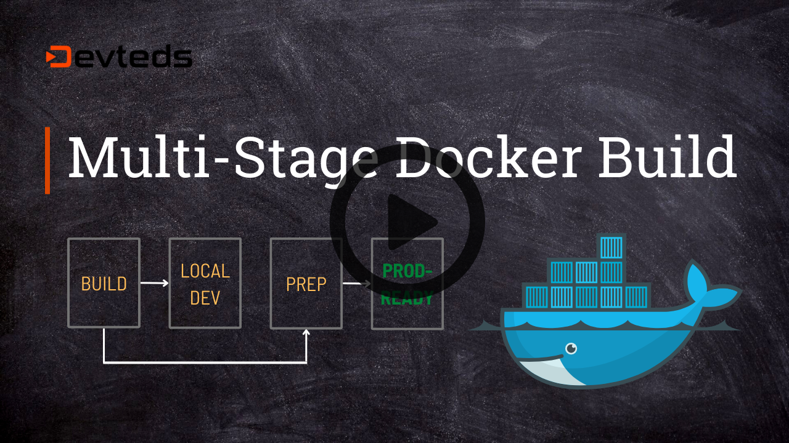

# Multi-Stage Docker Build: How to Build Production-Ready Docker Image

The source code is for the [short course](https://devteds.com/multi-stage-docker-build)

## Announcement: Course on Kubernetes

> If you want to start deploying your containers to Kubernetes, especially on AWS EKS, [check this course on Kubernetes](https://www.devteds.com/kubernetes-course-aws-eks-terraform) that walkthrough creating Kubernetes cluster on AWS EKS using Terraform and deploying multiple related containers applications to Kubernetes and more. https://www.devteds.com/kubernetes-course-aws-eks-terraform 

---

This short course, the [Multi-Stage Docker Build](https://devteds.com/multi-stage-docker-build), is for Developers and DevOps engineers that have some basic knowledge of creating Dockerfile and building docker images, wanting to learn creating multi-stage Dockerfile to build production-ready docker images. In this free short course, we will step through,

- Dockerizing an exisitng application (a Rails application)
- Not too much into the Rails but give a quick walkthrough for Non-Rails developers
- Build Docker Image (without multi-stage), test and run the container locally
- A short overview of how the Dockerfile will be structured for multi-stage
- Transform the Dockerfile with multi-stage for development environment
- Extend to add more stages and build final, deployable and prod-ready image
- Using the deployable image, run container locally to test the prod-ready image

[Course video link](https://youtu.be/EkOCLmvwEhc)

[](https://devteds.com/multi-stage-docker-build/)

Visit https://devteds.com to watch all the videos and courses on DevOps and Cloud courses.


## Terminal Window Log

### Code

```
mkdir ~/projs
git clone https://github.com/devteds/multi-stage-docker-build.git multi-stage-docker-build
cd multi-stage-docker-build
```

### Build and Run locally

```
# Run on local
docker-compose build
docker-compose up

open http://localhost:3101/posts
open http://localhost:3101/admin
```

### Build for prod and test

```
# stop all containers (Ctl + C)

docker build -t blog-app-prod --target=prod .

# uncomment blog-app-prod service and,
docker-compose up blog-app-prod
open http://localhost:3102/posts
```


## Tools & Versions I used

- Ruby 3.1.2
- Ruby on Rails 7.0.3
- MySQL 5.7
- MacOS 12.0.1
- Docker 20.10.11
- Docker 1.29.2 (and v2)

## References

- 
